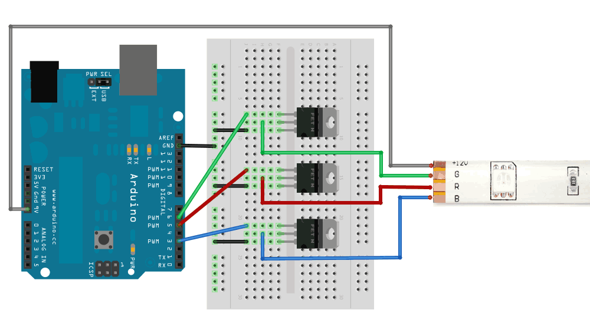

LEDwebServer
============

arduino project to control a led strip via http.

to use, update the IP address and point your browser to: http://x.x.x.x/RRGGBB
where RRGGBB is a RGB color hex code.

parts
=====

[Amico 5 Pcs BUZ91A 30V 60A N-channel Power MOSFET Transistors](http://www.amazon.com/gp/product/B0087YK0CO)
[LEDwholesalers 16.4ft RGB Color Changing Kit with LED Flexible Strip, Controller with 44-button Remote and Power Supply, 2034RGB+3315+3215](http://www.amazon.com/gp/product/B0040FJ27S)

I used the RGB color changing kit above, but the final product only needs the LED strip.

wiring diagram
==============

I believe this diagram came from the awesome [adafruit](http://www.adafruit.com), check them out.
